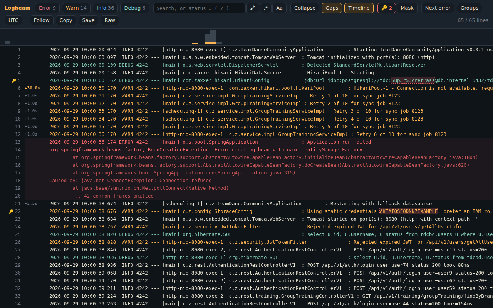
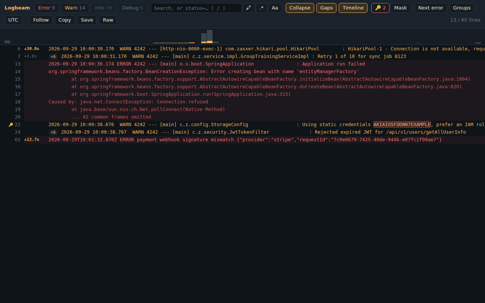
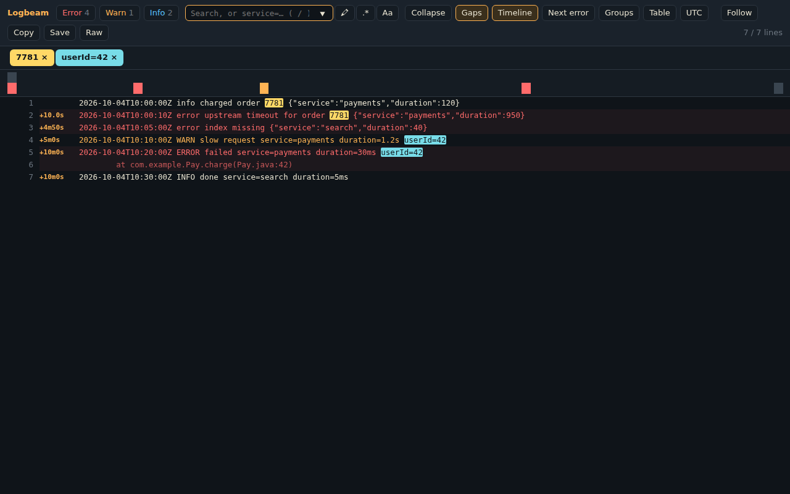
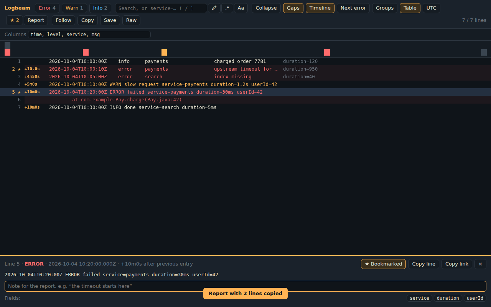
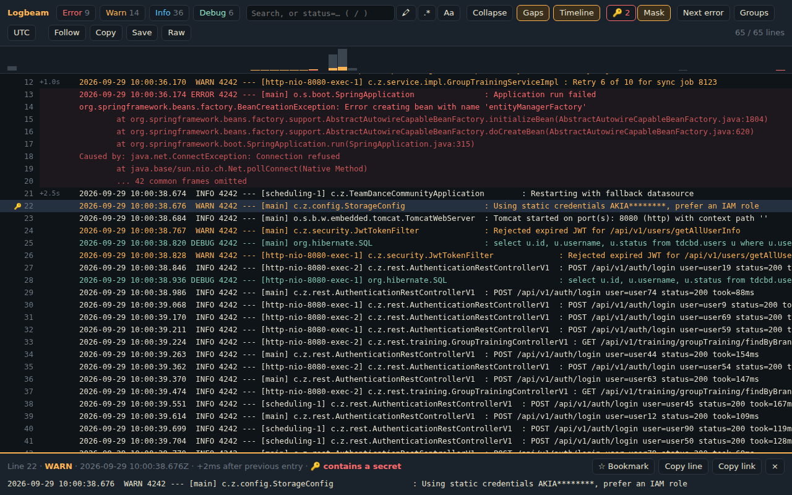
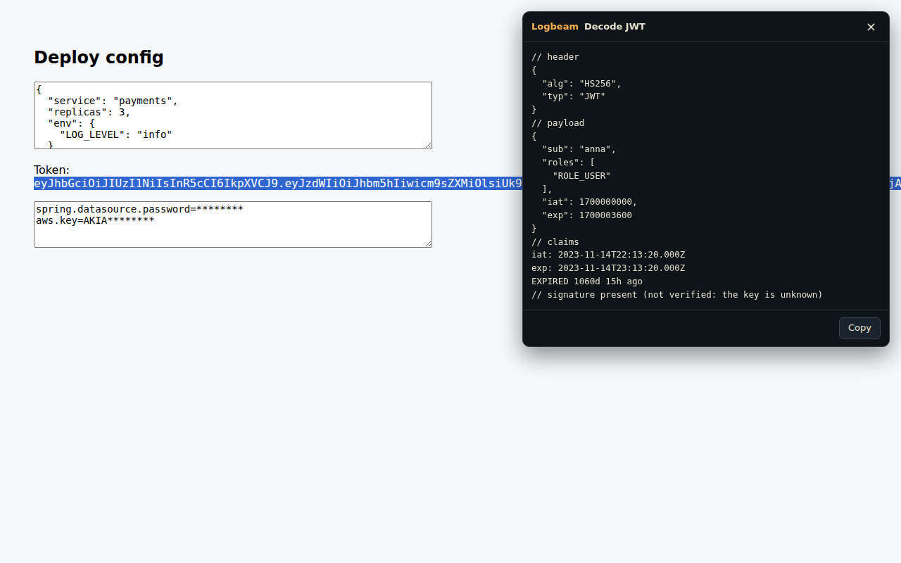
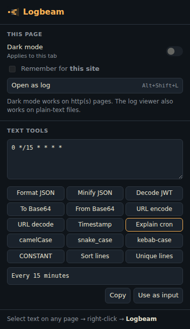
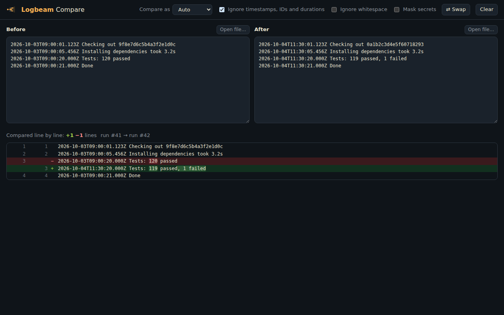

<p align="center">
  
</p>

<h1 align="center">Logbeam</h1>

<p align="center"><b>Make logs readable again.</b></p>

<p align="center">
  <a href="https://chromewebstore.google.com/detail/logbeam/kgjadbnghdgmcafdfgjhgfgcgnnnmcpe"></a>
  <a href="https://chromewebstore.google.com/detail/logbeam/kgjadbnghdgmcafdfgjhgfgcgnnnmcpe"></a>
  <a href="https://chromewebstore.google.com/detail/logbeam/kgjadbnghdgmcafdfgjhgfgcgnnnmcpe"></a>
  <a href="https://addons.mozilla.org/firefox/addon/logbeam/"></a>
  <a href="https://github.com/andronaft/Logbeam/actions/workflows/ci.yml"></a>
  
  
  
</p>

A browser extension for Chrome and Firefox, for developers and platform engineers: a fast log viewer that also **catches leaked
secrets**, dark mode for any site, and the text tools you keep opening random websites for (JSON, JWT,
Base64, timestamps, cron). All of it runs locally; no data leaves your browser.

<p align="center">
  <a href="https://chromewebstore.google.com/detail/logbeam/kgjadbnghdgmcafdfgjhgfgcgnnnmcpe"><b>➜ Add to Chrome</b></a>
  &nbsp;·&nbsp;
  <a href="https://addons.mozilla.org/firefox/addon/logbeam/"><b>➜ Add to Firefox</b></a>
  &nbsp;— free
</p>

<p align="center">
  
</p>

## Features

### 🔦 Log viewer

Open any raw log (a `.log` file, "View raw logs" in GitHub Actions, Jenkins console output, `kubectl logs`
piped to a file…) with **Ctrl+Shift+L** (**⌃⇧L** on Mac) or from the popup:

- **Levels in colour** (`ERROR`, `WARN`, `INFO`, `DEBUG`, `TRACE`) with counters and one-click filters
- **Stack traces stay with their error**: Java `at …` / `Caused by:`, Python tracebacks and Go goroutines are
  grouped with the entry above, so filtering by `ERROR` shows the whole trace
- **Search** as plain text or **regex**, case-sensitive if you like, with highlighted matches
- **JSON logs** (Logback/Logstash, pino, bunyan, zap…) shown as `time LEVEL message {fields}`, including
  records pretty-printed over several lines
- **Filter by fields**: `level=error service=payments duration>500`, on JSON logs and `key=value` lines alike,
  with `!=`, `>`, `<`, `*` wildcards, nested paths (`http.status>=500`) and units (`duration>1.5s`)
- **Time range**: drag across the timeline to keep only the entries from that time
- **Highlights**: press Enter in the search box to keep a term highlighted in its own colour (up to five)
- **Pods and containers**: `kubectl logs --prefix` and `docker compose logs` get a coloured chip per pod
- **Pasted text and files**: open a log pasted into the popup, or a `.log` / **`.gz`** file (unpacked in the
  browser); drop a file onto any viewer to open it
- **Save** the visible lines as a file
- **Bookmarks and notes** (`m`, `b`): **Report** copies them as Markdown for a ticket, with times and links
- **Field statistics**: the most common values of a field (`status: 200 ×1520, 502 ×37`), one click to filter
- **Error groups**: each different error once, with its count, pods and first and last time
- **Follow** a log that is still being written: new lines are added every 3 seconds
- **JSON table** with the columns you choose, and **local time** instead of UTC
- **ANSI colours** from CI and Docker logs, **your own level words** (`ALERT` → ERROR), and a **light theme**
- **Compare** this log with another one, e.g. a passing and a failing CI run (see below)
- **Pauses between entries**: `+5.5s` next to lines where the app stalled
- **Collapse repeats**: 500 × `retry 17 of 50 for job 8123` becomes one line with a `×500` badge
- **Error timeline**: a histogram of entries, errors and warnings over time; click a bar to jump there
- **Line inspector**: click a line to read it in full, with its time, pause and, for JSON records, all fields
- **Links to lines**: click a line number to copy a `#L120` link that opens the viewer right on that line
- **Next error** (`e`), search (`/`), copy visible lines, back to raw
- **Open automatically** on sites you choose (opt-in per site, only plain-text pages that look like logs)
- Fast on **150k+ lines**: logs over 1 MB are parsed in a **Web Worker** with a progress bar, and only the
  rows on screen are in the DOM

<p align="center"></p>
<p align="center"></p>
<p align="center"></p>

### 🔑 Secret detection

Credentials in logs are how leaks start. Logbeam marks every line that shows one: AWS keys, GitHub, GitLab,
Slack and Stripe tokens, Google API keys, JWTs, private keys, `postgres://user:password@…` URLs and
`password=…` / `"apiKey": "…"` settings (placeholders like `${DB_PASSWORD}` are ignored).

- 🔑 next to the line and the value highlighted; `s` jumps to the next one
- **Mask** hides the values on screen and in everything you copy: `AKIA****************`
- **Mask secrets** in the right-click menu cleans up any selected text or input before you paste it into a chat

<p align="center"></p>

### 🌙 Dark mode for any site

Toggle it from the popup or with **Ctrl+Shift+K** (**⌃⇧K** on Mac). Pages that already have a dark theme are
detected and left alone, and turning it off never reloads the page. "Remember for this site" asks for access to **that one
site only**, and from then on the dark theme is applied before the page paints, so there's no white flash.
Photos and videos keep their real colours.

### 🧰 Text tools

Select text on any page → right-click → **Logbeam**, or paste it into the popup:

| Tool                      | Example                                                                           |
| ------------------------- | --------------------------------------------------------------------------------- |
| Mask secrets              | `password=hunter2hunter2` → `password=********`                                   |
| Format / minify JSON      | `{"a":1}` → pretty-printed, or back to one line                                   |
| Decode JWT                | header, payload, `iat`/`exp` as dates, "valid for another 59m" / "EXPIRED 3h ago" |
| Base64 encode / decode    | UTF-8 safe, understands URL-safe Base64 without padding                           |
| URL encode / decode       | `a b&c` ⇄ `a%20b%26c`                                                             |
| Timestamp ⇄ date          | `1700000000` → `2023-11-14T22:13:20Z`, and back                                   |
| Explain cron              | `0 */15 * * * *` → "Every 15 minutes"; catches `*/900` in the seconds field       |
| Case conversion           | `userProfileId` ⇄ `user_profile_id` ⇄ `user-profile-id` ⇄ `USER_PROFILE_ID`       |
| Sort / de-duplicate lines |                                                                                   |

In an input, textarea or rich editor, **Replace selection** writes the result back in place (undo works).

<p align="center">
  
  
</p>

### ⚖️ Compare

Open **Compare** from the popup, or use **Compare…** in the right-click menu (or the log viewer's Compare
button) on one text and then on the other:

- **Logs**: a line diff with the changed words marked and unchanged parts folded. **Ignore timestamps, IDs and
  durations** lines up two runs of the same job, so `2026-10-03T09:00:20Z Tests: 120 passed` against
  `2026-10-04T11:30:20Z Tests: 119 passed, 1 failed` shows only the test result as changed
- **JSON**: compared by key, so key order doesn't matter, with a list of changed paths (`$.env.LOG_LEVEL`,
  `$.ports[1]`) and exact comparison of numbers too big for JavaScript (`12345678901234567890`)
- Open or drop files, swap sides, ignore whitespace, mask secrets in the output

<p align="center"></p>

## Privacy and permissions

Logbeam has no server and no analytics, and it makes no network requests.

| Permission                     | Why                                                                                                        |
| ------------------------------ | ---------------------------------------------------------------------------------------------------------- |
| `activeTab`, `scripting`       | Run the log viewer or a text tool on the tab you clicked, only when you ask                                |
| `contextMenus`                 | The right-click menu                                                                                       |
| `storage`                      | Remember your per-site settings                                                                            |
| optional host access, per site | Only when you turn on "Remember dark mode" or "Open logs automatically" for a site, and only for that site |

Logbeam never asks for access to all sites up front. See the [privacy policy](PRIVACY.md).

## Install

**From the Chrome Web Store:** [Logbeam on the Chrome Web Store](https://chromewebstore.google.com/detail/logbeam/kgjadbnghdgmcafdfgjhgfgcgnnnmcpe),
one click and it updates itself. Works in Chrome, Edge, Brave, Opera and other Chromium browsers.
**From Firefox Add-ons:** [Logbeam on addons.mozilla.org](https://addons.mozilla.org/firefox/addon/logbeam/)
(Firefox 140 or newer). The dark-mode shortcut there is **Ctrl+Shift+.**, because Ctrl+Shift+K opens
Firefox's Web Console.

**From source:**

```bash
npm ci
npm run build
```

Then open `chrome://extensions`, turn on **Developer mode**, click **Load unpacked** and choose the `dist/`
folder. To open local `file://` logs, also enable **Allow access to file URLs** on the extension's details page.

In Firefox, open `about:debugging#/runtime/this-firefox`, click **Load Temporary Add-on** and pick
`dist-firefox/manifest.json`.

## Development

```bash
npm run watch         # rebuild on change, then press ↻ on chrome://extensions
npm test              # unit tests (Vitest)
npm run e2e           # load the extension into Chromium with Playwright, click through it, save docs/*.png
npm run e2e:firefox   # the same for the Firefox build, with Selenium (needs Firefox and geckodriver)
npm run lint:firefox  # the checks addons.mozilla.org runs on upload
npm run check         # lint + format + typecheck + unit tests + build (what CI runs)
npm run package       # logbeam-<version>.zip (Chrome), logbeam-firefox-<version>.zip, sources for AMO
npm run store-assets  # Chrome Web Store screenshots and promo tiles from docs/*.png
npm run icons         # regenerate the PNG icons (drawn in code, no image editor needed)
```

Releases: bump the version, add a `CHANGELOG.md` entry and push a `vX.Y.Z` tag. The release workflow runs every
check including the end-to-end test, attaches the ZIP to a GitHub Release, and uploads it to the Chrome Web Store
for review. Setup and details: [docs/PUBLISHING.md](docs/PUBLISHING.md).

```

```

```
src/
├── background.ts        service worker: context menu, keyboard shortcuts, permission events
├── content/
│   ├── logViewer.ts     virtualized log viewer: filters, inspector, timeline, secrets, #L links
│   ├── parseAsync.ts    Web Worker parsing (Blob worker) with a chunked main-thread fallback
│   ├── parseWorker.ts   the worker itself, inlined into the viewer at build time
│   ├── autoOpen.ts      opt-in per site: opens plain-text logs automatically
│   └── panel.ts         result panel for the text tools (Shadow DOM, no style clashes)
├── lib/                 pure logic, fully unit-tested
│   ├── logs.ts          incremental parser: levels, timestamps, JSON, stack traces, filters, repeats
│   ├── secrets.ts       credential detection and masking
│   ├── timeline.ts      error/warning histogram
│   ├── segments.ts      overlapping highlights (search matches inside secrets)
│   ├── transforms.ts    JSON, JWT, Base64, URL, timestamps, case, lines, mask secrets
│   └── cron.ts          cron → plain English (5 and 6 field, macros, names)
├── shared/
│   ├── darkMode.ts      per-site dark mode with dynamic content scripts
│   ├── autoOpen.ts      per-site auto-open registration
│   └── inject.ts        on-demand script injection
├── popup/               toolbar popup
└── dark.css             the dark theme itself
```

### Design notes

- **Least privilege.** Everything works through `activeTab` on a click or a shortcut. Remembered dark-mode
  sites use `chrome.permissions.request` for a single origin plus `chrome.scripting.registerContentScripts`,
  so the extension never holds `<all_urls>`.
- **Manifest V3 service worker.** The worker can be stopped at any time, so state such as remembered sites,
  tab-only dark mode and pending permission requests lives in `chrome.storage`, not in variables.
- **Trusted Types safe.** The viewer and panel build DOM nodes rather than assigning `innerHTML`, so they work
  on sites that enforce Trusted Types, like GitHub and Google.
- **Big logs off the main thread.** A content script can't start a worker from the extension's own URL
  (different origin), so the worker is built separately, inlined as a string and started from a Blob. Pages
  whose CSP blocks that fall back to parsing in chunks between frames. The e2e test covers both paths.
- **Pure core.** Parsing, secret detection and transforms have no DOM or `chrome.*` dependencies, which keeps
  them easy to test: 61 unit tests plus 30 end-to-end checks in a real Chromium.

## Roadmap

- [x] Open `text/plain` logs in the viewer automatically (opt-in per site)
- [x] Secret detection and masking
- [x] Parsing large logs in a Web Worker
- [x] Settings page (gap threshold, your own secret patterns, which tools to show)
- [x] Field filters, time ranges, highlights, pods, `.gz` files
- [x] Bookmarks and notes, field statistics, error groups, Follow, JSON table, local time
- [x] Ukrainian for the popup and menus ([help translate the rest](https://github.com/andronaft/Logbeam/labels/translation))
- [x] Diff two JSON documents or two logs
- [x] Multi-line JSON log records
- [x] Firefox build

## License

[MIT](LICENSE)
